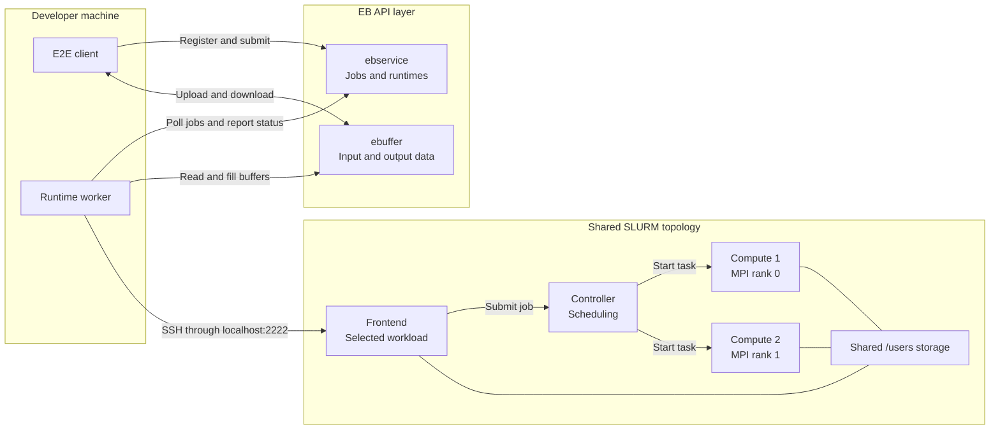

# canonical Exa-AtoW with nxc
Proof of concept and canonical example for deploying Exa-AtoW style HPC infrastructure using NixOS-Compose.

## Architecture



This repository exposes two NixOS-Compose compositions over one shared HPC
topology:

- `openqcd` (the default) runs a small, real OpenQCD 2.0 HMC workload;
- `mpi-hello` is a fast two-node MPI diagnostic.

Both compositions deploy ebuffer, ebservice, a SLURM frontend and controller,
and two compute nodes. Only the selected workload is installed on the frontend
and compute roles.

To integrate another application, follow the step-by-step
[mdBook tutorial](docs/tutorial/quickstart.md).


## Repository layers

The implementation keeps three responsibilities separate:

| Layer | Location | Responsibility |
| --- | --- | --- |
| Shared infrastructure | `composition.nix` | Builds the role-neutral ebuffer, ebservice, shared-storage, Munge, and SLURM topology from injected modules and a test script. |
| Workload software | `software/default.nix` | Maps each composition name to the NixOS module installed on its frontend and compute nodes. |
| Workload validation | `e2e/nxc/` and `e2e/*.py` | Supplies app-specific NXC tests and host-side API contracts while reusing common readiness and lifecycle code. |

`compositions.nix` joins the software and NXC-test catalogs and rejects
mismatched keys. `e2e/nxc/common.nix` checks service and SLURM readiness before
each app-specific NXC test. On the host side, `e2e/common.py` owns the shared
API, SSH, scheduler, transfer, timeout, diagnostics, and cleanup lifecycle;
`mpi_hello_e2e.py` and `openqcd_e2e.py` define only their application
contracts.

Adding a third plug-in therefore requires matching software and E2E catalog
entries: a module in `software/`, an `e2e/nxc/` test, and a host application
contract registered by `e2e/minimal-e2e.py`.


## End-to-end behavior

The default `just test` path:

1. authenticates with ebservice;
2. registers the OpenQCD microservice and compatible runtime;
3. uploads `e2e/openqcd-ym1.in` and creates scheduler and output ebuffers;
4. submits a two-node SLURM job through the frontend;
5. runs one `ym1` rank on each compute VM;
6. returns `openqcd-e2e.log` through ebuffer;
7. validates the lattice and process grid, one trajectory, configuration
   export, and a finite plaquette on the client.

`just test mpi-hello` follows the same shared lifecycle without an input
ebuffer. It returns `mpi-hello.out` and requires ranks 0 and 1 to report from
two distinct compute hosts.

These tests cover the current local package, API, shared-storage, SLURM, MPI,
and output-transfer paths. They do not establish production security,
persistent storage, normal remote SCP, full scheduler accounting, large
transfers, non-VM E2E behavior, portable CPU emulation, failure recovery, or
concurrent multi-user behavior.

See the [development notes](docs/DevNotes.md) for the local compatibility
adapters and testing shortcuts.


## Commands

The default flavour is `vm` and the default workload is `openqcd`. For
`build`, `up`, and `down`, the flavour remains the first optional argument and
the workload is second:

```console
just up                            # openqcd::vm
just up vm mpi-hello               # mpi-hello::vm

just down docker                  # stop openqcd::docker
```

The two test layers select only a workload because they exercise the VM
flavour:

```console
just nxc-test                      # OpenQCD in-topology integration test
just nxc-test mpi-hello

just tunnel                        # expose the running OpenQCD VM
just tunnel mpi-hello

just test                          # OpenQCD API-to-SLURM host E2E
just test mpi-hello
```

`just nxc-test` builds the selected composition and runs its test from inside
NXC. `just test` expects that composition's VM deployment to be running,
establishes its tunnels, and launches the matching host E2E. Use
`just install` once to create `e2e/.venv` from the locked dependencies.

For the pinned NXC version, stop a VM deployment by interrupting its foreground
`just up` process with Ctrl-C. Its standalone VM stop path calls a missing
`VmFlavour.cleanup()` method; `just down` remains available for flavours such
as Docker that implement cleanup.


## Documentation

The repository includes a full mdBook with separate concepts, architecture,
tutorial, and reference sections:

```console
just docs
just docs-serve
```

The generated site is written to `book/`; the live server defaults to
`http://127.0.0.1:3000`. Start at the
[book introduction](docs/README.md) or browse its
[table of contents](docs/SUMMARY.md).

Commits to the default branch publish the book on
[GitLab Pages](https://exa-atow.gricad-pages.univ-grenoble-alpes.fr/canonical-exa-atow-with-nxc/).
