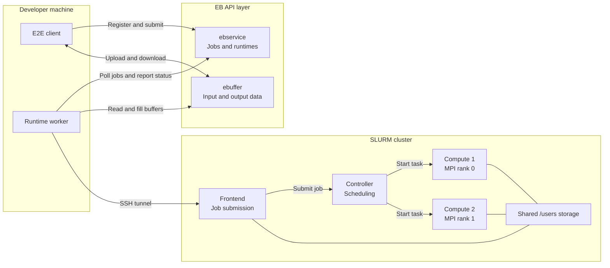
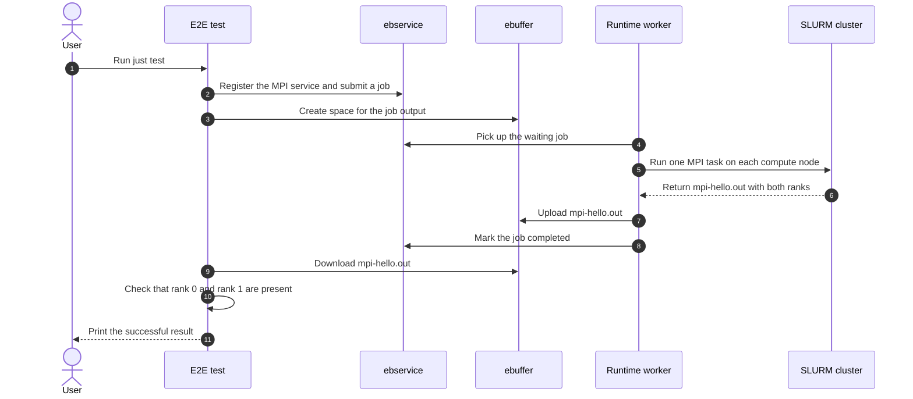

# Canonical HPC Composition

This repository defines one NixOS Compose topology: `hpc`. It deploys an
ebuffer server, ebservice, a SLURM frontend and controller, and two compute
nodes. All roles share one network and are built with the same VM or Docker
flavour.

To integrate your own scientific application, follow the step-by-step
[HPC-as-a-Service usage guide](Usage.md).

HPC workloads are plug-ins rather than composition logic. Modules listed in
`software/default.nix` are installed on the frontend and every compute node.
The default `mpi-hello.nix` plug-in builds a small MPI program and composes the
OpenMPI runtime it needs. Add another module for a compiler, library, or
application and import it from `software/default.nix`.

`examples/mpi-hello.sbatch` runs two MPI ranks, one on each compute node. The
composition test submits the equivalent job and checks that both ranks finish.
This verifies package deployment, shared storage, SLURM scheduling, and MPI
launching together.

The ebuffer and ebservice roles contain no workload-specific policy. Their
files under `config/` are bootstrap settings; clients use the services through
their network APIs (`ebuffer` and `ebservice` hostnames inside the composition).

## Architecture



All six VM nodes share the private NXC network. Only the two HTTP APIs and
frontend SSH are forwarded to the developer machine; the controller, compute
nodes, and shared storage stay internal.

```console
just test
```

With a VM deployment already running, `just tunnel` forwards the ebuffer API
to `http://localhost:8000/api/v1`, the ebservice API to
`http://localhost:8001/api/v1`, and frontend SSH to `localhost:2222`. `just
test` establishes those tunnels, registers a minimal MPI microservice and
runtime through ebservice, submits the job through the client template, and
requires both MPI ranks to finish through SLURM. Internal controller and
compute-node ports remain on the composition network.

## End-to-end sequence

At a high level, the test sends a job through the APIs, runs it on the cluster,
stores its result in ebuffer, and downloads that result for verification.



The default flavour is `vm`.

## What this test proves—and what it does not

It does prove the current local path:

1. authenticate with ebservice;
2. register a microservice and compatible runtime;
3. create scheduler and output ebuffers;
4. let the runtime pick up the API-submitted job;
5. submit a two-node SLURM job through the frontend;
6. run one MPI rank on each compute VM;
7. upload the result into ebuffer;
8. download it through the client API and verify both ranks.

It does not prove production security, persistent storage, normal remote SCP,
full scheduler monitoring/accounting, large transfers, non-VM flavours,
portable CPU emulation, failure recovery, or concurrent multi-user behavior.
Those are the main places to remove shortcuts if this topology grows beyond a
minimal local integration test.

see [here](DevNotes.md) for more insights on the "hacks" that were needed to make this work.
