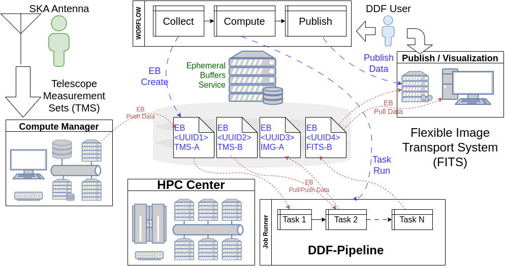

# The HPC-as-a-Service mental model


<p align="center" style="padding: 30px 0px" >
  
</p>


Traditional HPC users often begin with a shell, a batch script, and a command
such as `sbatch`. A service-facing workflow begins somewhere else: a client
describes a computation and attaches data without needing to speak directly to
the scheduler.


## Control plane and data plane

The **control plane** carries descriptions and state:

```text
client -> ebservice -> runtime -> SLURM controller -> slurmd
```

The **data plane** carries files:

```text
client <-> ebuffer <-> runtime <-> /users job directory <-> compute ranks
```


## Why keep the scheduler?

Wrapping an application in an API does not replace the facility scheduler.
SLURM still owns admission, placement, resource limits, task launch, job
state, and cancellation. The service adapter turns an application-level
request into a scheduler-native request.

That separation lets each layer speak its natural language:

- the client speaks application inputs and outputs;
- the runtime speaks service objects, SSH, files, and scheduler commands;
- SLURM speaks nodes, tasks, CPUs, partitions, and states; and
- the application speaks its own command-line and scientific file formats.
